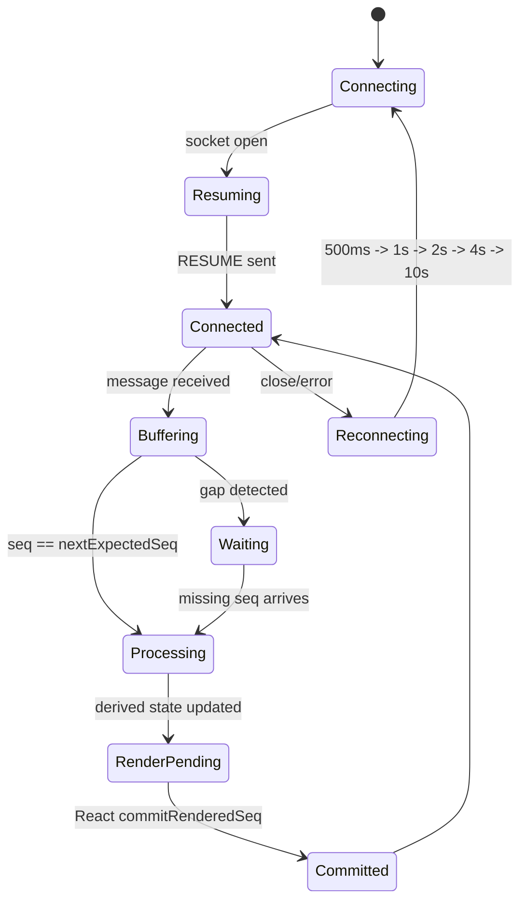

# Signal Yard

Signal Yard is a Next.js App Router agent operations console for evaluator-facing protocol runs. It defaults to `ws://localhost:4747/ws`, keeps protocol state outside React, and renders chat streams, tool calls, trace rows, context diffs, reconnect evidence, and chaos artifacts in one console.

## Run

```bash
npm install
npm run build
npm run start
```

For local development:

```bash
npm run dev
```

The production runtime expects the provided Docker `agent-server` to serve the WebSocket protocol at `ws://localhost:4747/ws`. Deterministic non-production scenarios are available with `?scenario=tool-stream`, `?scenario=reconnect`, `?scenario=rapid-tools`, `?scenario=large-context`, and `?scenario=chaos`.

## Submission Checklist

- Repository contains the app source, protocol engine, UI components, tests, screenshots, chaos recording, and decision notes.
- Generated dependency/build/test folders are ignored: `node_modules`, `.next`, `playwright-report`, and `test-results`.
- Primary evidence artifacts are committed under `docs/`:
  - `docs/screenshots/tool-stream.png`
  - `docs/screenshots/trace-tools-filter.png`
  - `docs/screenshots/context-diff.png`
  - `docs/recordings/chaos.webm`
- Decision rationale is documented in `DECISIONS.md`.

## Architecture

- `src/protocol/engine.ts`: WebSocket lifecycle, resume-first reconnect, ordered seq buffer, dedupe, heartbeat, immediate PONG, TOOL_ACK policy, journal, and derived snapshots.
- `src/protocol/types.ts`: discriminated unions plus Zod validation for inbound `unknown`.
- `src/workers/contextDiff.worker.ts`: worker-backed JSON diffing for context snapshots, with a synchronous test/runtime fallback.
- `src/components/*`: React views that subscribe with `useSyncExternalStore` and render derived state only.
- `tests/unit/*`: protocol ordering, replay, heartbeat, ACK, streaming, and diff tests.
- `tests/e2e/*`: browser scenarios and deliverable screenshot/recording capture.



## Test And Capture

```bash
npm run test
npm run test:e2e
npm run screenshots
```

`npm run screenshots` writes:

- `docs/screenshots/tool-stream.png`
- `docs/screenshots/trace-tools-filter.png`
- `docs/screenshots/context-diff.png`
- `docs/recordings/chaos.webm`

The recording path is the mandatory chaos artifact. External submission hosting/name details are intentionally left for final submission time.

## Deployment

The repository is sufficient for code review and automated evaluation. A deployment is useful if the submission form asks for a live URL or if evaluators need to inspect the UI without cloning the repo.

For Vercel, import the GitHub repository and use the default Next.js settings:

- Install command: `npm install`
- Build command: `npm run build`
- Output: Next.js default

The deployed app can demonstrate deterministic local scenarios with query strings such as `?scenario=tool-stream` and `?scenario=chaos`. A live production protocol run still needs a reachable WebSocket server compatible with the assignment protocol.

## Protocol Notes

Server events must include positive integer `seq` values. Signal Yard deduplicates received seqs, buffers future seqs until gaps fill, processes ordered events only, and advances `lastRenderedSeq` only from a React post-commit effect. `PING` is the control-plane exception: `PONG` is sent immediately on receipt, while PING/PONG timeline rows still render in seq order.
