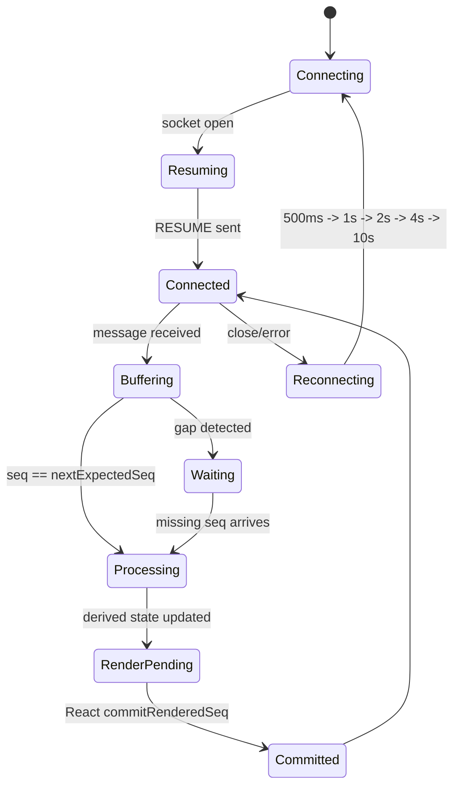

# Signal Yard

This is my submission for the Full Stack AI Engineer assignment. It is a Next.js App Router app that connects to the provided agent server at `ws://localhost:4747/ws`, streams agent responses, shows tool calls, keeps a trace timeline, displays context snapshots, and handles reconnects.

## Run

Install dependencies and run the production build:

```bash
npm install
npm run build
npm run start
```

For development:

```bash
npm run dev
```

The app expects the provided Docker `agent-server` to be running on port `4747`.

```bash
docker build -t agent-server ./agent-server
docker run -p 4747:4747 agent-server
```

For chaos mode:

```bash
docker run -p 4747:4747 agent-server --mode chaos
```

I also added local scenarios for testing without the backend:

- `?scenario=tool-stream`
- `?scenario=reconnect`
- `?scenario=rapid-tools`
- `?scenario=large-context`
- `?scenario=chaos`

## What Is Included

- App source and UI components
- WebSocket protocol handling
- Reconnect and resume handling
- Ordered sequence buffering and duplicate handling
- Context diffing
- Unit and e2e tests
- Screenshots and chaos recording under `docs/`
  - `docs/screenshots/tool-stream.png`
  - `docs/screenshots/trace-tools-filter.png`
  - `docs/screenshots/context-diff.png`
  - `docs/recordings/chaos.webm`
- Notes about the main decisions in `DECISIONS.md`

## Project Structure

- `src/protocol/engine.ts` has the WebSocket lifecycle, reconnect logic, sequence ordering, dedupe, heartbeat, and `TOOL_ACK` handling.
- `src/protocol/types.ts` has the protocol types and validation.
- `src/protocol/contextDiff.ts` and `src/workers/contextDiff.worker.ts` handle context diffs.
- `src/components/` has the chat, trace timeline, and context inspector UI.
- `tests/unit/` has protocol and diff tests.
- `tests/e2e/` has browser tests and screenshot/recording capture.

## State Machine



## Tests

```bash
npm run test
npm run test:e2e
npm run screenshots
```

`npm run screenshots` writes:

- `docs/screenshots/tool-stream.png`
- `docs/screenshots/trace-tools-filter.png`
- `docs/screenshots/context-diff.png`
- `docs/recordings/chaos.webm`

## Protocol Notes

The client processes server messages by `seq`. It buffers future messages until the missing sequence arrives and ignores duplicate sequence numbers. `lastRenderedSeq` is advanced after React commits the rendered state, so reconnects use the last event that was actually rendered.

Live `PING` is handled immediately so the server gets a timely `PONG`, including for empty heartbeat challenges. During resume replay, historical `PING` events are rendered in the timeline without sending new `PONG`s, because the server no longer has those old heartbeat challenges pending.
