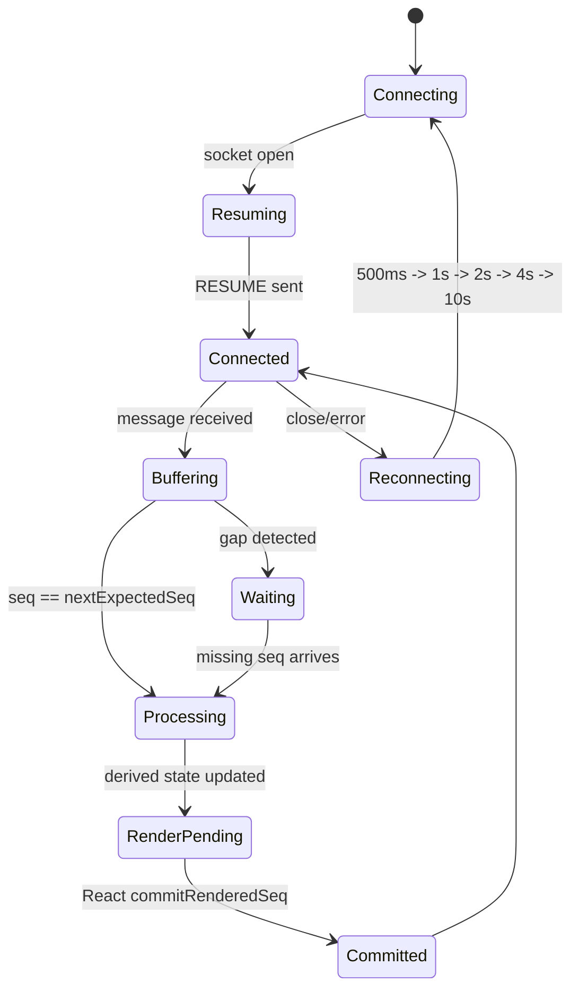

# Signal Yard

This is my submission for the Full Stack AI Engineer assignment. It is a Next.js App Router app that connects to the provided agent server at `ws://localhost:4747/ws`, streams agent responses, shows tool calls, keeps a trace timeline, displays context snapshots, and handles reconnects.

## Run

Install dependencies and run the production build:

```bash
npm install
npm run build
npm run start
```

For development:

```bash
npm run dev
```

The app expects the provided Docker `agent-server` to be running on port `4747`.

```bash
docker build -t agent-server ./agent-server
docker run -p 4747:4747 agent-server
```

For chaos mode:

```bash
docker run -p 4747:4747 agent-server --mode chaos
```

I also added local scenarios for testing without the backend:

- `?scenario=tool-stream`
- `?scenario=reconnect`
- `?scenario=rapid-tools`
- `?scenario=large-context`
- `?scenario=chaos`

## What Is Included

- App source and UI components
- WebSocket protocol handling
- Reconnect and resume handling
- Ordered sequence buffering and duplicate handling
- Context diffing
- Unit and e2e tests
- Screenshots and chaos recording under `docs/`
  - `docs/screenshots/tool-stream.png`
  - `docs/screenshots/trace-tools-filter.png`
  - `docs/screenshots/context-diff.png`
  - `docs/recordings/chaos.mp4` (and the raw `chaos.webm` it was transcoded from) — a real ~4.5 minute recording captured against the actual Dockerized `agent-server --mode chaos` (not a scripted fixture). See "Chaos Recording" below.
- Notes about the main decisions in `DECISIONS.md`

## Project Structure

- `src/protocol/engine.ts` has the WebSocket lifecycle, reconnect logic, sequence ordering, dedupe, heartbeat, and `TOOL_ACK` handling.
- `src/protocol/types.ts` has the protocol types and validation.
- `src/protocol/contextDiff.ts` and `src/workers/contextDiff.worker.ts` handle context diffs.
- `src/components/` has the chat, trace timeline, and context inspector UI.
- `tests/unit/` has protocol and diff tests.
- `tests/e2e/` has browser tests, screenshot capture, and the real chaos-mode recording spec.

## State Machine


```mermaid
stateDiagram-v2
  [*] --> Connecting
  Connecting --> Resuming: socket open
  Resuming --> Connected: RESUME sent
  Connected --> Buffering: message received
  Buffering --> Processing: seq == nextExpectedSeq
  Buffering --> Waiting: gap detected
  Waiting --> Processing: missing seq arrives
  Processing --> RenderPending: derived state updated
  RenderPending --> Committed: React commitRenderedSeq
  Committed --> Connected
  Connected --> Reconnecting: close/error
  Reconnecting --> Connecting: 500ms -> 1s -> 2s -> 4s -> 10s
```

## Tests

```bash
npm run test         # unit tests (vitest)
npm run test:e2e     # deterministic harness e2e tests (no Docker required)
npm run screenshots  # regenerates the three docs/screenshots/*.png files
```

`npm run test:e2e` runs the fast, deterministic suite (`console.spec.ts`, `screenshots.spec.ts`) against the local scripted harness (`?scenario=...`), so it never depends on Docker and is safe for CI. `tests/e2e/chaos-live.manual.spec.ts` is intentionally excluded from this run (see `testIgnore` in `playwright.config.ts`) because it depends on a real, external Docker container and runs for several minutes. It has its own command and config — see "Chaos Recording" below.

## Chaos Recording

`docs/recordings/chaos.webm` is produced separately, against the real Dockerized `agent-server --mode chaos` (not the local harness):

```bash
docker run -p 4747:4747 agent-server --mode chaos
npm run record:chaos
```

`tests/e2e/chaos-live.manual.spec.ts` drives the actual live socket for ~4.5 minutes: it sends a rotating set of prompts (`hello`, `schema/database/large`, `analyze/compare`, `long/detailed`, `lookup/find`, `summary/q3`) every ~35s so the server's randomized per-connection chaos profile gets many chances to fire every documented failure mode. It uses `playwright.chaos.config.ts` (a single Chromium project, a 6-minute test timeout) rather than the default config. Playwright always writes `.webm`; it was transcoded to `docs/recordings/chaos.mp4` with `ffmpeg -i chaos.webm -c:v libx264 -pix_fmt yuv420p chaos.mp4` for wider compatibility.

The recording overlays a live checklist, driven by reading the protocol engine's real snapshot every 500ms (`window.__SIGNAL_YARD_ENGINE__.getSnapshot()`) rather than by scripting expected outcomes, so every checkmark reflects a genuinely observed event, not a canned animation:

- **Connection drop mid-stream -> reconnect**: detected via a `connected -> not connected` transition, confirmed by the server's `/log` showing a follow-up `RESUME` with `verdict: "ok"`.
- **Out-of-order / duplicate seq handled**: `stats.duplicateSeqs` or `stats.gapBuffered` > 0.
- **Rapid sequential tool calls**: 2+ tool cards pending/acked at the same time.
- **Oversized context snapshot (500KB+)**: `stats.bytesReceived` > 500KB.
- **Corrupt heartbeat (empty challenge)**: a `PING` timeline row with `detail === "challenge: "`, answered with an empty-echo `PONG` that the server logs as `verdict: "ok"`.

After recording, cross-check `curl http://localhost:4747/log` for the session: in the capture used for submission, 37 of 39 recorded client events were `verdict: "ok"` (all `PONG`s, `RESUME`s, `TOOL_ACK`s, `USER_MESSAGE`s). The 2 non-`ok` entries were a single `TOOL_ACK_TIMEOUT` immediately followed by our (now-late) `TOOL_ACK` landing as `"unexpected"` — a real, observed instance of the `TOOL_ACK` race condition discussed in `DECISIONS.md`, not a client crash or dropped message.

## Protocol Notes

The client processes server messages by `seq`. It buffers future messages until the missing sequence arrives and ignores duplicate sequence numbers. `lastRenderedSeq` is advanced after React commits the rendered state, so reconnects use the last event that was actually rendered.

Live `PING` is handled immediately so the server gets a timely `PONG`, including for empty heartbeat challenges. During resume replay, historical `PING` events are rendered in the timeline without sending new `PONG`s, because the server no longer has those old heartbeat challenges pending.
